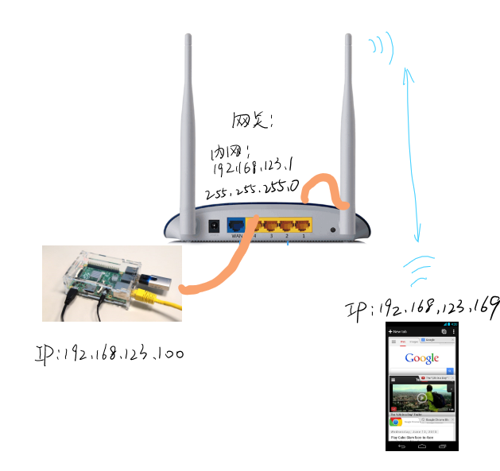

---

title: 搭http服务器（一） Overview

---

说是搭http服务器，其实就是简单地、完整地、实现一个小网站，侧重不在于web应用本身，目的是能在搭完对网络的一些概念有个实际的了解，当然之前清楚计算机网络更好，不清楚也没关系，终究只是好玩儿，玩一下。

文章理论上应该分为五块：
* 搭http服务器（一）Overview
* 搭http服务器（二）配置树莓派
* 搭http服务器（三）配置Openwrt路由器
* 搭http服务器（四）树莓派配置LAMP
* 搭http服务器（五）开发web程序和搭建更多的服务

然鹅只要稍微用一下搜索引擎，一、二、三、四、五就都不用讲了，所以我们就想到哪扯到哪，剩下没讲的客官自己搜索吧。

# Overview

说是搭http服务器，它本质上是程序。而一个程序的运行需要操作系统，需要实际的硬件作为载体，我们选择的载体是树莓派，操作系统是Raspbian，服务器本身的架构选择经典的LAMP(Linux + Apache + MySQL + PHP)。http服务器终究只是web应用的一种，我们其实可以在树莓派上搭各种各样的服务器，那要涉及到端口映射等等的概念，这是后话。

搭建了网站，我们想要用其它设备访问，就要接入网络。如果要接入因特网，你至少需要公网IP，或者购买域名，解析服务，服务器，甚至备案等等。这些太麻烦了，我们把目标订小一点——手机连上路由器，可以http://ip:port/ 的方式访问树莓派上的网站，这样就足够了。

我们算是在构建一个系统，所以先想好一个蓝图很关键。我们的蓝图以IP和数据流为核心。
首先，要实现的目标是手机访问树莓派上的web应用(网站)，所以我们暂时不把路由器接入更大的网络里面。
也就是我们的访问范围全围绕着路由器，树莓派B和手机C都在路由器A的子网下，路由器要分别给手机和树莓派分配IP地址，这样路由器A就能够连接B和C，不过路由为什么可以实现这一点？和交换机又有什么不一样呢？

如果非得画个示意图的话，就像上图一样，路由器dhcp或静态给下面两个设备分配IP地址，让两个设备可以相互访问(不过具体怎么分配的呢？为什么有了IP就可以访问？访问又是怎样实现的？)。
上图中，你应该把路由器的内部网络一端设置为DHCP模式；否则就是配置静态路由，手动给MAC分配IP；一般可以忽略这一步。
上图中有一根网线 一端连接树莓派的rj45端口，一端连接在路由器的LAN4端口；手机则连接到wifi；路由器的LAN可以看作是个交换机，它在内部又设置的和wifi网卡相连组成共同的内网段：192.168.123.0，子网掩码255.255.255.0，也就是从192.168.123.1-192.168.123.255任一IP地址都可以分配给路由器的子设备（子网掩码又是个什么东西？什么原理？怎么设置呢？）。

到这里我们就在物理上连接完成了这个系统。

# 思考题

1. 除了http还有什么web服务？共同原理是什么？
2. http服务器是怎么实现输入http://ip:port/ 就能访问页面的呢？
3. wifi路由器为什么能连接手机和树莓派这两个用不同物理方式接入的设备？
4. 路由器是怎么分配的ip地址？dhcp和静态路由分配地址是怎么实现的？
5. 子网掩码是什么？怎么设置？路由器怎么组成的子网？